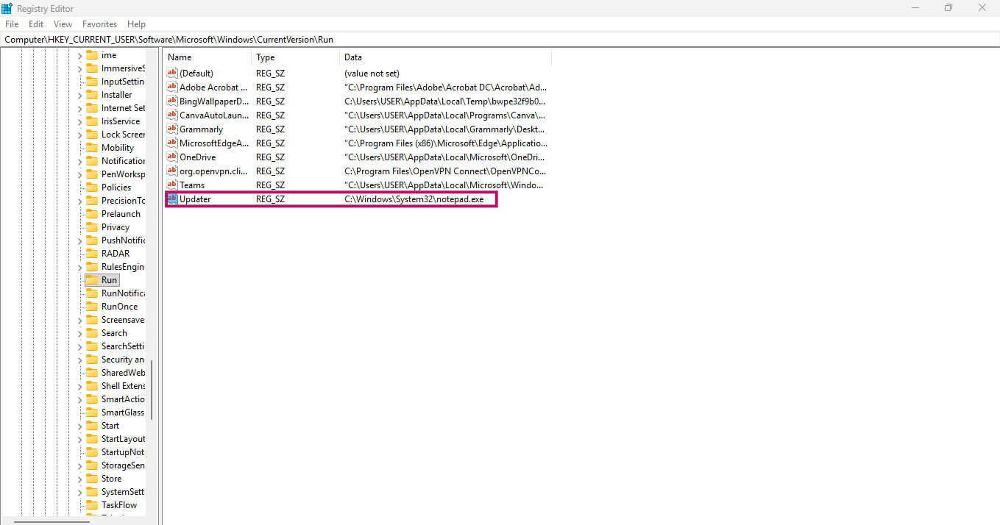
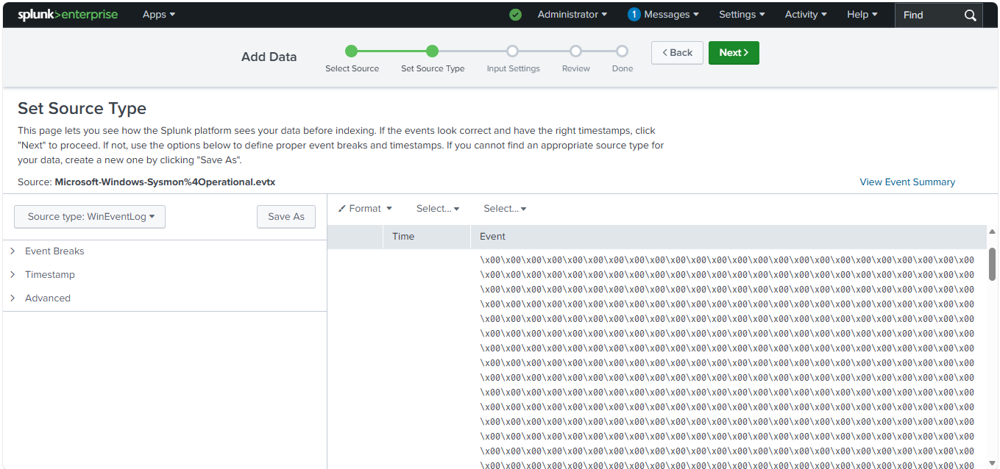
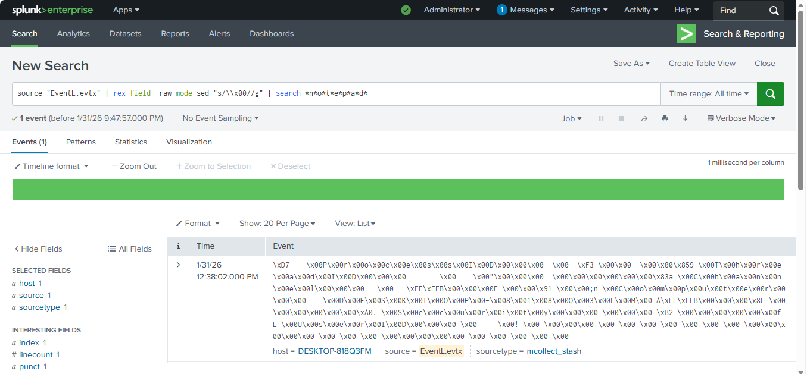

# 🛡️ Windows Registry Persistence Detection using Splunk

## 📖 Project Overview
This project focuses on **Digital Forensics and Threat Hunting**. The goal was to detect a common **Persistence technique** where an attacker modifies the Windows Registry to execute a malicious file on system startup. I used **Splunk SIEM** to ingest, clean, and analyze encoded Windows Event Logs to find the "Malicious" entry.

---

## 🛠️ Tech Stack
| Component | Technology |
| :--- | :--- |
| **SIEM** | Splunk Enterprise |
| **Analysis** | Windows Event Logs (.evtx) |
| **Investigation** | Windows Registry Forensics |
| **Commands** | Regex (REX), SED, Wildcard Searching |

---

## 🚀 Investigation Workflow

### 1. Simulating the Attack
I simulated an attack by creating a registry value named `Updater` under the `Run` key. This ensures that every time the computer starts, `notepad.exe` (representing a malware payload) executes automatically.
* **Key:** `HKEY_CURRENT_USER\Software\Microsoft\Windows\CurrentVersion\Run`


*Image: Creating the malicious 'Updater' key (ttttttt.png)*

---

### 2. The Forensic Challenge
After importing the logs into Splunk, the raw data appeared with **Null Bytes (`\x00`)**. This made it impossible to find the evidence using a standard text search as the characters were separated by null markers.


*Image: Raw Windows Event logs showing encoding issues (splsys-7.png)*

---

### 3. Log Normalization & Cleaning
To reveal the hidden data, I applied a specialized Splunk query using the `rex` command with `mode=sed` to strip out the null bytes. This normalization process made the logs human-readable and searchable.


*Image: Final Splunk output showing the identified persistence mechanism (splsys-8.png)*

**Final Splunk Query used for discovery:**

```splunk
source="EventL.evtx" 
| rex field=_raw mode=sed "s/\\x00//g" 
| search *n*o*t*e*p*a*d*
**Final Splunk Query used for discovery:**
```splunk

source="EventL.evtx" 
| rex field=_raw mode=sed "s/\\x00//g" 
| search *n*o*t*e*p*a*d*

